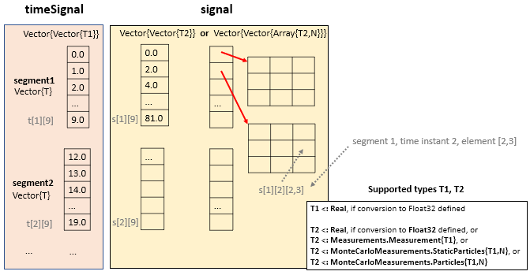

# ModiaResult

[](https://modiasim.github.io/ModiaResult.jl/stable/index.html)
[](https://github.com/ModiaSim/ModiaResult.jl/blob/master/LICENSE.md)

ModiaResult is part of [ModiaSim](https://modiasim.github.io/docs/). See also the ModiaResult [documentation](https://modiasim.github.io/ModiaResult.jl/stable/index.html).

ModiaResult defines an abstract interface for **simulation results** and provides overloaded methods for:

- Dictionaries,

- [DataFrame](https://github.com/JuliaData/DataFrames.jl) tables, 

- [Tables](https://github.com/JuliaData/Tables.jl) (for example [CSV](https://github.com/JuliaData/CSV.jl)), and

- ModiaResult.ResultDict (special dictionary with all features of the interface). 

Additionally, **operations** on simulation results are provided, especially to produce **line plots** in a **convenient way** based on 

- [GLMakie](https://github.com/JuliaPlots/GLMakie.jl) (interactive plots in an OpenGL window),
- [WGLMakie](https://github.com/JuliaPlots/WGLMakie.jl) (interactive plots in a browser window),
- [CairoMakie](https://github.com/JuliaPlots/CairoMakie.jl) (static plots on file with publication quality),
- [PyPlot](https://github.com/JuliaPy/PyPlot.jl) (plots with Matplotlib from Python) and 
- NoPlot (= all plot calls are ignored; NoPlot is a module in ModiaResult), or
- SilentNoPlot (= NoPlot without messages; SilentNoPlot is a module in ModiaResult).

More details:

- [Getting Started](https://modiasim.github.io/ModiaResult.jl/stable/GettingStarted.html)
- [Functions](https://modiasim.github.io/ModiaResult.jl/stable/Functions.html)
- [Abstract Interface](https://modiasim.github.io/ModiaResult.jl/stable/AbstractInterface.html)


## Installation

All packages are registered and are installed with:

```julia
julia> ]add ModiaResult
        add ModiaPlot_GLMakie       # if plotting with GLMakie desired
        add ModiaPlot_WGLMakie      # if plotting with WGLMakie desired
        add ModiaPlot_CairoMakie    # if plotting with CairoMakie desired
        add ModiaPlot_PyPlot        # if plotting with PyPlot desired
```

If you have trouble installing `ModiaPlot_PyPlot`, see 
[Installation of PyPlot.jl](https://modiasim.github.io/ModiaResult.jl/stable/index.html#Installation-of-PyPlot.jl)
 
 
## Example

Assume that the result data structure is available, then the following commands


```julia
import ModiaResult

# Define plotting software globally
ModiaResult.activate("PyPlot") # or ENV["MODIA_PLOT"] = "PyPlot"

# Execute "using ModiaPlot_<globally defined plot package>"
ModiaResult.@usingModiaPlot   # = "using ModiaPlot_PyPlot"

# Generate line plots                     
plot(result, [("sigA", "sigB", "sigC"), "r[2:3]"])
```

generate the following plot:


# Abstract Result Interface

For every result data structure a few access functions have to be defined
(for details see Abstract Interface](https://modiasim.github.io/ModiaResult.jl/stable/AbstractInterface.html)).
Most importantly:


```
(timeSignal, signal, signalType) = ModiaResult.rawSignal(result, name)
```

Given the result data structure `result` and a variable `name::AbstractString`,
return the result values of the independent variable (= `timeSignal`), the 
corresponding result values of the variable (= `signal`) and the type
of the signal. The following figure sketches the returned `timeSignal` and `signal` data structures:



Other signal types might be mapped to this basic signal type by introducing views.


## Main developer

[Martin Otter](https://rmc.dlr.de/sr/en/staff/martin.otter/),
[DLR - Institute of System Dynamics and Control](https://www.dlr.de/sr/en)

