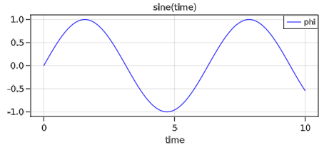

# Getting Started

Note, many examples are available at `$(ModiaResult.path)/test_plot/*.jl`.


## Simple plot

The following example defines a simple line plot of a sine wave:

```julia
import ModiaResult

# Define plotting software globally
ModiaResult.activate("GLMakie") # or ENV["MODIA_PLOT"] = "GLMakie"

# Define result data structure
t = range(0.0, stop=10.0, length=100)
result = Dict("time" => t, "phi" => sin.(t))

# Generate line plot
ModiaResult.@usingModiaPlot  # = "using ModiaPlot_GLMakie"
plot(result, "phi", heading = "Sine(time)")
```
Executing this code results in the following plot:




## Plot with segmented time axes

A more complex example is shown in the next definition, where the signals have units, are scalars and vectors, have different time axes and are not always defined over the complete time range.
 

```julia
import ModiaResult
using  Unitful

# Define plotting software globally
ModiaResult.activate("PyPlot") # or ENV["MODIA_PLOT"] = "PyPlot"

# Define result data structure
t0 = ([0.0, 15.0], [0.0, 15.0], ModiaResult.TimeSignal)
t1 = 0.0  : 0.1 : 15.0
t2 = 0.0  : 0.1 : 3.0
t3 = 5.0  : 0.3 : 9.5
t4 = 11.0 : 0.1 : 15.0

sigA1 = 0.9*sin.(t2)u"m"
sigA2 =     cos.(t3)u"m"
sigA3 = 1.1*sin.(t4)u"m"
R2    = [[0.4 * cos(t), 0.5 * sin(t), 0.3 * cos(t)] for t in t2]u"m"
R4    = [[0.2 * cos(t), 0.3 * sin(t), 0.2 * cos(t)] for t in t4]u"m"

sigA  = ([t2,t3,t4], [sigA1,sigA2,sigA3 ], ModiaResult.Continuous)
sigB  = ([t1]      , [0.7*sin.(t1)u"m/s"], ModiaResult.Continuous)
sigC  = ([t3]      , [sin.(t3)u"N*m"]    , ModiaResult.Clocked)
r     = ([t2,t4]   , [R2,R4]             , ModiaResult.Continuous)
    
result = ModiaResult.ResultDict("time" => t0, 
                                "sigA" => sigA,
                                "sigB" => sigB,
                                "sigC" => sigC,
                                "r"    => r,
                                defaultHeading = "Segmented signals") 
                        
# Generate line plots                     
ModiaResult.@usingModiaPlot   # = "using ModiaPlot_PyPlot"
plot(result, [("sigA", "sigB", "sigC"), "r[2:3]"])
```

Executing this code results in the following plot:


## SilentNoPlot in runtests

Typically, `runtests.jl` of a simulation package should utilize `SilentNoPlot` to perform all 
tests without using a plot package:

```julia
# File runtests.jl
import ModiaResult
ModiaResult.activate("SilentNoPlot") # stores current plot package on a stack

< run all tests >

ModiaResult.activatePrevious() # retrieves previous plot package from stack
```


